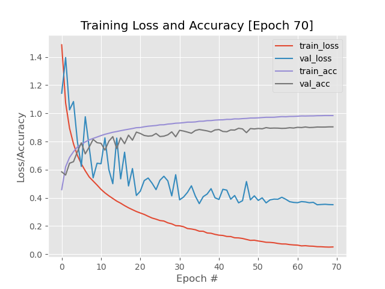

# MiniGoogLeNet-Miniception
Implementing the MiniGoogLeNet architecture using the Miniception

### Requirements:
* python3
* keras
* numpy V1.19.2
* scikit-image V0.17.2
* opencv-python
* matplotlib V3.2.2
* tensorflow

### CNN architectures implemented in this repository:
*MiniGoogLeNet* architectue using the Miniception.

* *Miniception* module is a smaller variant of the Inception module.

* Inside the *Inception* module, we learn all three 5x5, 3x3, 1x1 filters (computing them in parallel)
  concatenating the resulting feature maps along the channel dimension.
  This process enables GoogLeNet to learn both local features via smaller convolutions and abstracted features with larger convolutions.

### CIFAR-10 Dataset:
> Dataset consisting of 60,000 (32x32x3 RGB images) resulting in a feature vector dimensionality of 3072. It consists of 10 classes: _airplanes, automobiles, birds, cats, deer, dogs, frogs, horses, ships, and trucks_.

### Evaluations of the Trained Networks:
**MiniGoogLeNet** Classification: [79% Accuracy on average](output/trained/minigooglenet_cifar10_trainingEval.txt)

### References:
* Deep Learning for Computer Vision with Python VOL1 & VOL2 by Dr.Adrian Rosebrock
